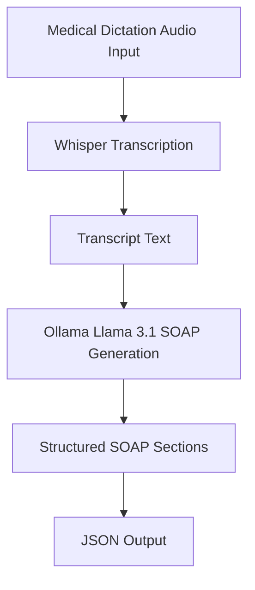

# SOAP Note Transcription

Transcribe medical dictation audio with OpenAI Whisper and generate a structured SOAP note (`Subjective`, `Objective`, `Assessment`, `Plan`) using Python.

## Features

- Transcribes audio from `data/audio.mp3` (or any file path you pass)
- Generates a structured SOAP summary from the transcript
- Saves output as JSON (`output.json` by default)
- Prints transcript + SOAP note in terminal

## Project Structure

- `transcribe_and_generate_soap.py`: Main transcription + SOAP generation script
- `prompts/soap_prompt.txt`: SOAP prompt template used for LLM formatting/style
- `requirements.txt`: Python dependencies
- `data/audio.mp3`: Sample medical dictation audio
- `output.json`: Generated result file

## Prerequisites

- Python 3.10+
- `ffmpeg` installed and available in `PATH`
- [Ollama](https://ollama.com/) installed and running
- A local model pulled in Ollama (default used by script: `llama3.1:8b`)

Install `ffmpeg` on macOS:

```bash
brew install ffmpeg
```

Pull the default Ollama model:

```bash
ollama pull llama3.1:8b
```

## Installation

```bash
python3 -m venv .venv
source .venv/bin/activate
pip install -r requirements.txt
```

## Run

Default run (uses sample audio in `data/audio.mp3`):

```bash
python3 transcribe_and_generate_soap.py
```

Use a custom SOAP prompt template (no code changes needed):

```bash
python3 transcribe_and_generate_soap.py --prompt-file prompts/soap_prompt.txt
```

You can also set prompt path with env var:

```bash
export SOAP_PROMPT_FILE=prompts/soap_prompt.txt
python3 transcribe_and_generate_soap.py
```

## Process Flow



## Output Format

The script writes JSON like this:

```json
{
  "audio_file": "data/audio.mp3",
  "transcript": "...",
  "soap_note": {
    "Subjective": "...",
    "Objective": "...",
    "Assessment": "...",
    "Plan": "..."
  }
}
```
